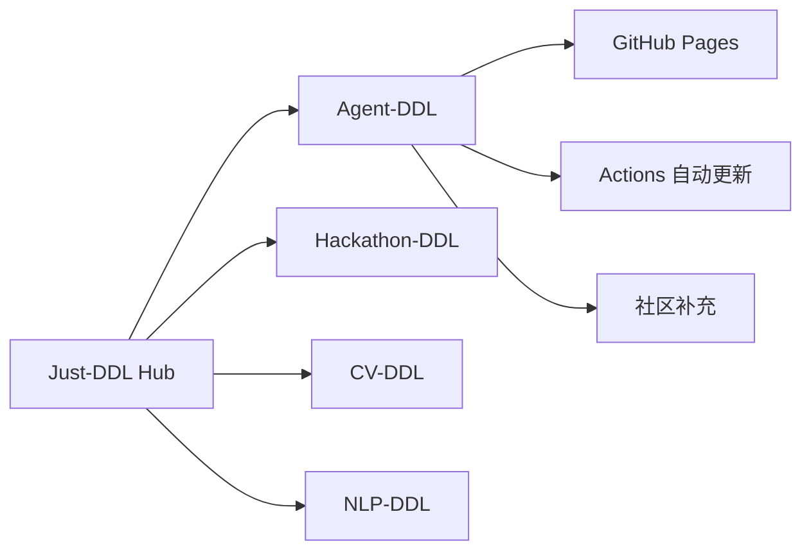

<div align="center">

# Agent-DDL

AI Agent 竞赛、Benchmark 挑战与智能体黑客松截止日追踪。

Just-DDL Network 的 Agent 专题仓库，独立维护智能体赛事数据，并同步到 Just-DDL 总入口。

[](https://just-agent.github.io/agent-ddl/)
[](https://react.dev/)
[](https://vite.dev/)
[](https://just-agent.github.io/just-ddl/)

[在线访问](https://just-agent.github.io/agent-ddl/) · [专题总入口](https://just-agent.github.io/just-ddl/) · [提交 Agent 赛事](https://github.com/Just-Agent/agent-ddl/issues) · [GitHub 仓库](https://github.com/Just-Agent/agent-ddl)

</div>

## 项目定位

Agent-DDL 聚焦 AI Agent 方向：智能体开发竞赛、Benchmark 排行挑战、LLM 工具调用评测、自动化工作流比赛以及 Agent Hackathon。这个仓库负责专题页面和专题数据，避免把所有抓取和部署逻辑塞进 Just-DDL 主仓库。

## 产品入口

| 入口 | 地址 | 用途 |
| --- | --- | --- |
| GitHub Pages | https://just-agent.github.io/agent-ddl/ | Agent 专题线上页面 |
| Just-DDL Hub | https://just-agent.github.io/just-ddl/ | 汇总全部 DDL 专题 |
| Repository | https://github.com/Just-Agent/agent-ddl | 数据、页面、工作流与贡献入口 |
| Issues | https://github.com/Just-Agent/agent-ddl/issues | 补充赛事、修正链接、报告过期信息 |

## Just-DDL Network



## 收录范围

| 类型 | 示例 | 记录字段 |
| --- | --- | --- |
| Agent Hackathon | 多智能体应用、工具调用、自动化工作流 | 报名、提交、决赛截止日 |
| Benchmark Challenge | WebArena、SWE、RAG、Tool Use 等方向 | 榜单、赛道、评测链接 |
| 企业挑战赛 | 云厂商、模型厂商、开发者平台活动 | 规则、奖金、提交格式 |
| 学术挑战 | Workshop challenge、shared task | 论文、代码、leaderboard |

## 页面能力

| 模块 | 当前能力 | 说明 |
| --- | --- | --- |
| 竞赛卡片 | 名称、时间、赛道、奖项、状态 | 适合快速扫 deadline |
| 详情页 | 描述、规则、链接、时间线 | 保留决策信息 |
| 统一导航 | Just-DDL Network 顶栏 | 可跳转 Hub、Hackathon、当前仓库 |
| Pages 部署 | main 分支自动发布 | 与 hub 保持一致风格 |

## 自动化策略

| Workflow | 目标 | 备注 |
| --- | --- | --- |
| `deploy-pages.yml` | 部署专题 GitHub Pages | 生产页面以 Actions 结果为准 |
| 后续 `daily-crawl.yml` | 增量更新 Agent 赛事源 | 等数据源稳定后加入 |
| 后续 `data-check.yml` | 校验日期、链接、必填字段 | 用于多人协作维护 |

## 本地开发

```bash
npm install
npm run dev
```

生产构建和 Pages 发布由 GitHub Actions 完成。本地环境不作为生产机验证依据。

## 路线图

| 阶段 | 事项 | 状态 |
| --- | --- | --- |
| 1 | Agent 专题 Pages 独立发布 | 完成 |
| 2 | 与 Just-DDL Hub 双向链接 | 完成 |
| 3 | 补充 Agent Benchmark 数据模型 | 进行中 |
| 4 | 自动爬取赛事源 | 计划中 |
| 5 | 微信小程序复用专题数据 | 计划中 |

## 贡献

提交 Agent 赛事时，请附上官网、报名截止、提交截止、评测方式、是否需要团队、奖金或证书信息。若时间使用本地时区，请注明时区。

## License

当前仓库处于产品孵化阶段。正式开源协议会在发布稳定版本前补齐。
